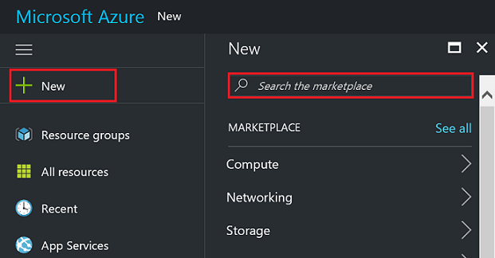
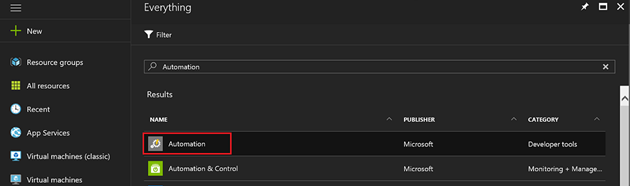
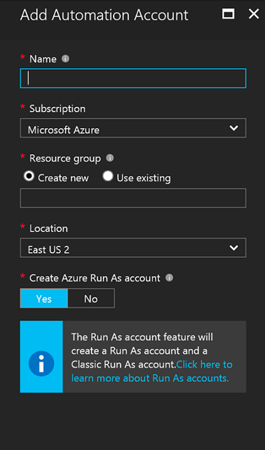
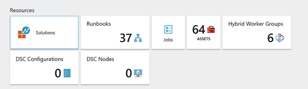
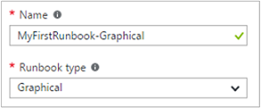
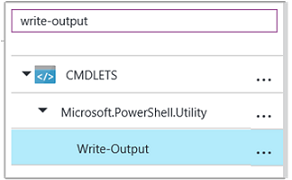
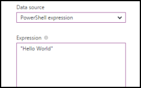
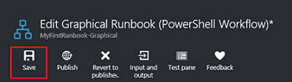
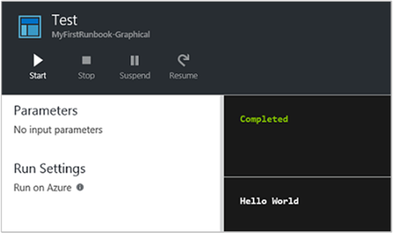

# Azure Automation Account
## Create a new Automation Account from the Azure portal

In this section, perform the following steps to create a Azure Automation account in the Azure portal.

1.	Sign in to the Azure portal with an account that is a member of the Subscription Admins role and co-administrator of the subscription.
2.	Click **New.**

3.	Search for **Automation** and then in the search results select **Automation & Control***.

4.	In the Automation Accounts blade, click **Add.**

5.	In the **Add Automation Account** blade, in the **Name** box type in a name for your new Automation account.
6.	If you have more than one subscription, specify one for the new account, a new or existing **Resource group** and an Azure datacenter **Location**.
7.	Verify the value **Yes** is selected for the **Create Azure Run As account** option, and click the **Create** button.
8.	While Azure creates the Automation account, you can track the progress under **Notifications** from the menu.

## Create runbook
We start by creating a simple runbook that outputs the text Hello World.

1.	In the Azure portal, open your Automation account.
The Automation account page gives you a quick view of the resources in this account. You should already have some Assets. Most of those are the modules that are automatically included in a new Automation account. You should also have the Credential asset that's mentioned in the [prerequisites](https://docs.microsoft.com/en-us/azure/automation/automation-first-runbook-graphical#prerequisites).
2.	Click the **Runbooks** tile to open the list of runbooks.

 
3.	Create a new runbook by clicking on the **Add a runbook** button and then **Create a new runbook**.
4.	Give the runbook the name *MyFirstRunbook-Graphical.*
5.	In this case, we're going to create a [graphical runbook](https://docs.microsoft.com/en-us/azure/automation/automation-graphical-authoring-intro) so select **Graphical** for **Runbook type**.

6.	Click **Create** to create the runbook and open the graphical editor.

## Add activities to the runbook
The Library control on the left side of the editor allows you to select activities to add to your runbook. We're going to add a **Write-Output** cmdlet to output text from the runbook.

1.	In the Library control, click in the search textbox and type **Write-Output**. The search results will be displayed below. 

2.	Scroll down to the bottom of the list. You can either right-click **Write-Output** and select **Add to canvas** or click the ellipse next to the cmdlet and then select **Add to canvas**.
3.	Click the **Write-Output** activity on the canvas. This opens the Configuration control blade, which allows you to configure the activity.
4.	The **Label** defaults to the name of the cmdlet, but we can change it to something more friendly. Change it to *Write Hello World to output*.
5.	Click **Parameters** to provide values for the cmdlet's parameters.
Some cmdlets have multiple parameter sets, and you need to select which you one to use. In this case, **Write-Output** has only one parameter set, so you don't need to select one. 

6.	Select the **InputObject** parameter. This is the parameter where we specify the text to send to the output stream.
7.	In the **Data source** dropdown, select **PowerShell expression**. The **Data source** dropdown provides different sources that you use to populate a parameter value.

    You can use output from such sources such as another activity, an Automation asset, or a PowerShell expression. In this case, we just want to output the text Hello World. We can use a PowerShell expression and specify a string.
8.	In the **Expression box**, type "Hello World" and then click OK twice to return to the canvas.

9.	Save the runbook by clicking **Save**.

## Test the runbook

Before we publish the runbook to make it available in production, we want to test it to make sure that it works properly. When you test a runbook, you run its Draft version and view its output interactively.
1.	Click **Test pane** to open the Test blade.

 

2.	Click **Start** to start the test. This should be the only enabled option.
	

3.	A [runbook job](https://docs.microsoft.com/en-us/azure/automation/automation-runbook-execution) is created and its status displayed in the pane.
The job status starts as *Queued* indicating that it is waiting for a runbook worker in the cloud to become available. It then moves to *Starting* when a worker claims the job, and then Running when the runbook actually starts running.
4.	When the runbook job completes, its output is displayed. In our case, we should see *Hello World*.
	

 

5.	Close the Test blade to return to the canvas.

