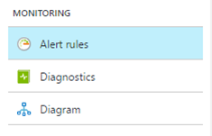
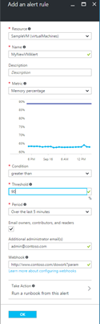

# Create an alert rule on a metric with the Azure portal

1.	In the [portal](https://portal.azure.com/), locate the resource you are interested in monitoring and select it.
2.	Select **Alerts** or **Alert rules** under the MONITORING section. The text and icon may vary slightly for different resources.

 

3.	Select the **Add alert** command and fill in the fields.

4.	**Name** your alert rule, and choose a **Description**, which also shows in notification emails.
5.	Select the **Metric** you want to monitor, then choose a **Condition** and **Threshold** value for the metric. Also chose the **Period** of time that the metric rule must be satisfied before the alert triggers. So for example, if you use the period "PT5M" and your alert looks for CPU above 80%, the alert triggers when the CPU has been consistently above 80% for 5 minutes. Once the first trigger occurs, it again triggers when the CPU stays below 80% for 5 minutes. The CPU measurement occurs every 1 minute.
6.	Check **Email owners...** if you want administrators and co-administrators to be emailed when the alert fires.
7.	If you want additional emails to receive a notification when the alert fires, add them in the **Additional Administrator email(s)** field. Separate multiple emails with semi-colons *- email@contoso.com;email2@contoso.com*
8.	Put in a valid URI in the **Webhook** field if you want it called when the alert fires.
9.	If you use Azure Automation, you can select a Runbook to be run when the alert fires.
10. Select **OK** when done to create the alert.

Within a few minutes, the alert is active and triggers as previously described.

