# AZURE IAAS MONITORING WITH OMS

## CREATE AN OMS WORKSPACE
The next step is to create a workspace.
1.	In the Azure portal, search the list of services in the Marketplace for Log Analytics, and then select **Log Analytics**.

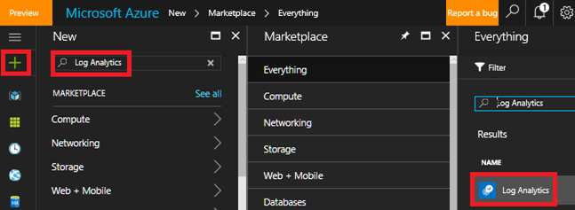
 

2.	Click **Create**, then select choices for the following items:

* **OMS Workspace** - Type a name for your workspace.
* **Subscription** - If you have multiple subscriptions, choose the one you want to associate with the new workspace.
* **Resource group**
* **Location**
* **Pricing tier**

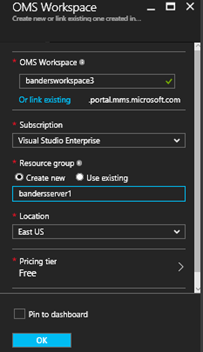
 
3.	Click **OK** to see a list of your workspaces.
4.	Select a workspace to see it's details in the Azure portal.

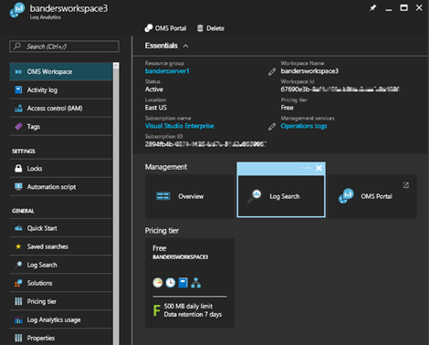
 
## ADD SOLUTIONS AND SOLUTION OFFERINGS

Next, add management solutions and solution offerings. Management solutions are a collection of logic, visualization, and data acquisition rules that provide metrics pivoted around a particular problem area. A solution offering is a bundle of management solutions.

Adding solutions to your workspace allows Log Analytics to collect various kinds of data from computers that are connected to your workspace using agents. We cover onboarding agents later.

To add solutions and solution offerings
1.	In Azure portal, click **New** and then in the **Search the marketplace** box, type **Activity Log Analytics** and then press ENTER.
2.	In the Everything blade, select **Activity Log Analytics** and then click **Create**.

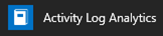
 
3.	In the *management solution name* blade, select a workspace that you want to associate with the management solution.
4.	Click **Create**.

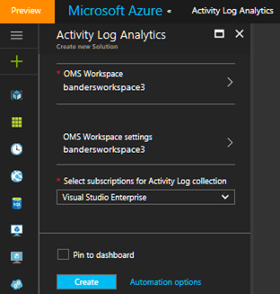

## CREATE VIRTUAL MACHINE
1.	Click the **New** button found on the upper left-hand corner of the Azure portal.
2.	Select **Compute**, select **Windows Server 2016 Datacenter**, and ensure that **Resource Manager** is the selected deployment model. Click the **Create** button.
3.	Enter the virtual machine information. The user name and password entered here is used to log in to the virtual machine. When complete, click **OK**.

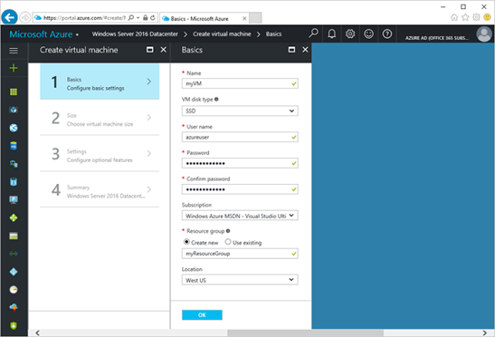

4.	Select a size for the VM. To see more sizes, select **View all** or change the **Supported disk type** filter.

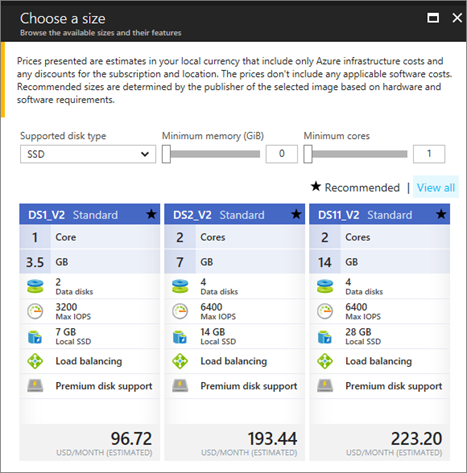

5.	On the settings blade, select **Yes** under **Use managed disks**, keep the defaults for the rest of the settings, and click **OK**.

6.	On the summary page, click **Ok** to start the virtual machine deployment.
7.	The VM will be pinned to the Azure portal dashboard. Once the deployment has completed, the VM summary blade automatically opens.

## CONNECT VM WITH OMS
1.	Sign into the [Azure portal](http://portal.azure.com/).
2.	Select **Browse** on the left side of the portal, and then go to **Log Analytics (OMS)** and select it.
3.	In your list of Log Analytics workspaces, select the one that you want to use with the Azure VM.

 
4.	Under **Log analytics management**, select **Virtual machines**.

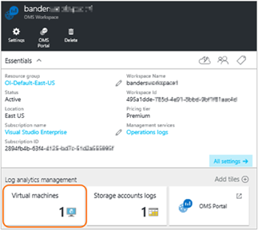

5.	In the list of **Virtual machines**, select the virtual machine on which you want to install the agent. The **OMS connection status** for the VM indicates that it is **Not connected**.

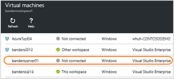

6.	In the details for your virtual machine, select **Connect**. The agent is automatically installed and configured for your Log Analytics workspace. This process takes a few minutes, during which time the OMS Connection status is *Connecting...*

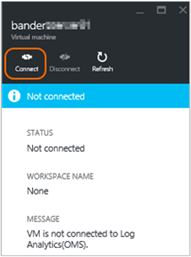
 
7.	After you install and connect the agent, the **OMS connection** status will be updated to show **This workspace**.

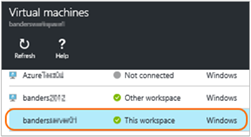
