# Lab Creating and Managing a Web App & Services

The Azure Portal is you one-stop-shop for creating and managing new cloud resources, like web apps, virtual machines and storage accounts. Once you get started, the portal will be your home to configure, monitor and scale your resources with ease and agility.

## Create a Web App
In this task you will walk through the different pieces of the Azure Portal.
1.	Open your browser and navigate to https://portal.azure.com. 
2.	Enter your credentials to access your *Azure Subscription*.

You will land on the portal, showing your dashboard.  The dashboard can be customized to show your commonly accessed resources.  You can also create and share multiple dashboards.

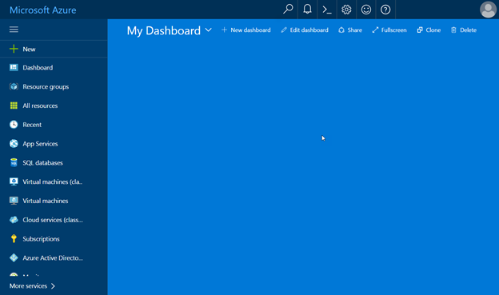

*Azure Portal – Dashboard*

3.	On the left side, notice the left navigation pane showing a listing of some services and tools.  These items are favorites and can be customized by clicking on the More Services item.  By clicking any of these items you will get a filtered resource list showing that specific type of resource.
 
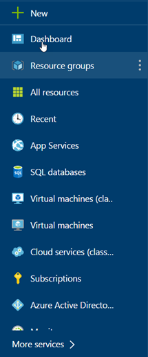

*Left Navigation Pane*

4.	If you look at the top of the Left Navigation Pane, you will notice the New button.  You will be using it later as you move on to the other tasks.

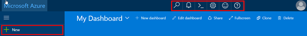

*New and Toolbar Buttons*

5.	On the top toolbar, you will notice there are a few tool buttons.

 Search -  for searching your subscriptions and resources.

 Notifications – location to find any change notifications that occur.

 Cloud Shell – opens an interactive browser-accessible shell for managing Azure resources

 Settings – general settings such as your theme colors, languages and regional format.

 Feedback – opens panel that allows you to send feedback about the portal

 Help – general staring location to get help on the Azure portal.  The help is context sensitive to the resource you are currently on.

## Creating new resources and services
In this task you will go through the process of creating a new resource for your subscription.  In particular, you will create a new web app.
1.	Click the New button located in the upper left corner of the screen, select Web + Mobile and then choose Web App from the featured apps list.

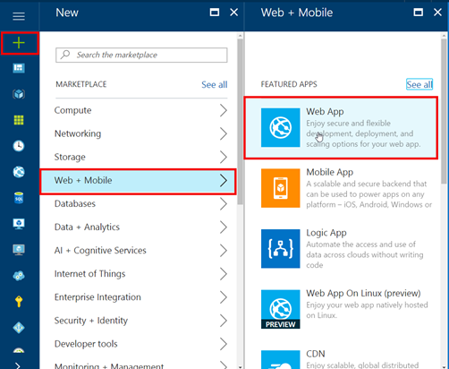

*Create a new Web App*

This will display the Web App Create blade.

2.	Enter an app name for your Web App, add Resource Group name and click Create.

Note: The app name has to be unique since it will be the public subdomain name.
 
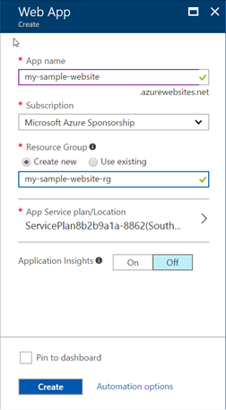

*Creating the Web App*

3.	Creating the web app should take less than a minute.  Once the site is created you will see a notification in the upper right corner of your screen.  If you click on the notification button, you will see the details about the resource being deployed.

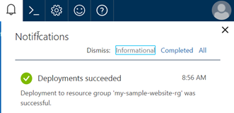

*Deployment Notification*

On the left navigation pane, click App Services in order to see the Web App you just created.

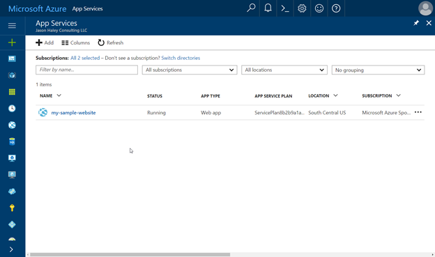

*App Services list showing new Web App*

4.	Click on the site name you just created to navigate to the web app’s Overview pane.

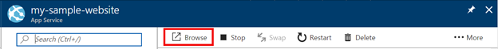

*Browse Button*

5.	Click the Browse button, located in the top toolbar of the Overview Pane.

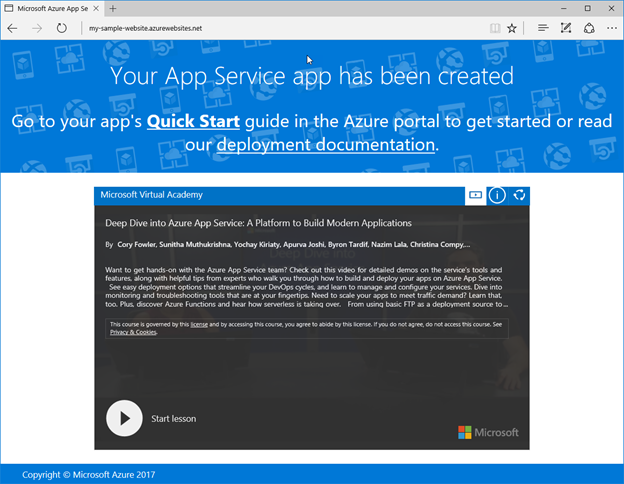

*Browsing to the Web App*

6.	Close the Web App and return to the Azure Portal.

## Managing allocated resources
In this task you will go through the available options for managing the recently created web app.
1.	If you are not already in the Overview pane of your web app, select App Services from the navigation pane and select your web app from the list.

This pane provides quick access to important actions related to managing the deployments of a web app. 

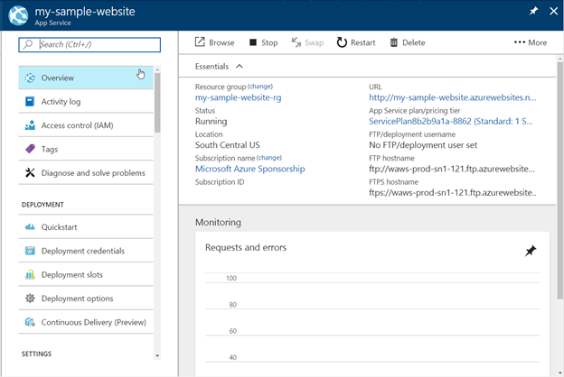

*Web App’s Overview Pane*

2.	Notice the toolbar buttons in the top of the pane.
* Browse – opens a browser tab and navigates to the current deployed web app
* Stop – stops the web app
* Swap – exchanges two different deployment slots
* Restart – restarts the web app
* Delete – deletes the web app
* More  - provides ability to get the publish profile or reset the publish profile

3.	Below the toolbar is the Essentials section which shows general information about web app and its app service environment:
* Resource group – name of the resource group the Web App is in
* Status – indicates the current status of the web app
* Location – indicates the location of the data center the web app is deployed to
* Subscription name and ID – information about the subscription the App Service is connected to
* URL – the public URL address of the web app
* App Service plan/pricing tier – the name and size of the App Service plan the web app is using
* FTP/deployment user name – shows the configured FTP user
* FTP hostname – the address of the ftp host to use if you are using FTP to deploy
* FTPS hostname – the address of the ftps host to use if you are using FTPS to deploy

Below the Essentials section is the Monitoring chart. 

4.	Click on the Monitoring chart, this will open the Metrics blade.

This blade allows you to configure chart that can be added to your Dashboard.  You can add and remove the metrics shown, change the time range, chart type, 

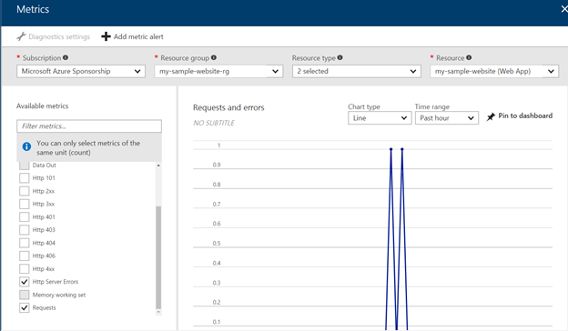
 
*Metrics Blade*

5.	Click the Pin to Dashboard button
6.	Next change the metrics by doing the following:

    Uncheck 
    * Http Server Errors
    * Requests items
    
    Check 
    * Average memory working set
    * Data In
    * Data Out

7.	Again, click the Pin to Dashboard button and Close the blade using the X in the upper right corner.
8.	Click the Dashboard button in the left navigation pane

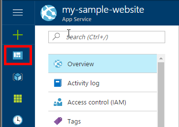

*Dashboard Button*

9.	Your dashboard should now have the two monitoring charts on it, showing you the metrics of your web app that you selected.

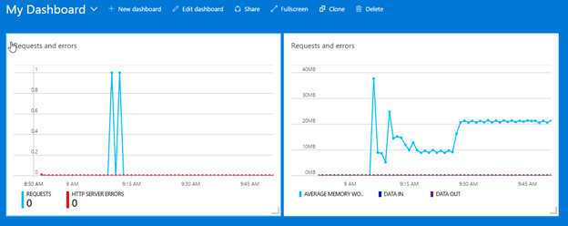

*Metrics Charts added from Web App*

10. Click on the App Services navigation button to get back to the App Service listing.  Click on the … for your web site and select Pin to Dashboard.  

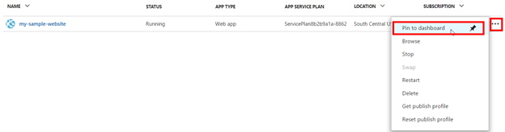

11. Again, go to your Dashboard.  You should now see a button for you web app

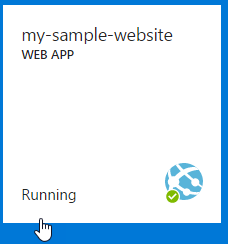

*Dashboard Web App Button*

## Explore features and services available

In this task you will explore the different features and services available to App Services and be introduced to what is available.

1.	Click on the new web app button you just added to the Dashboard to go directly to your Web App’s Overview pane.

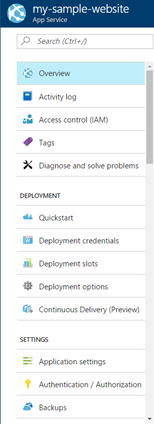

On the navigation pane inside of the Web App, there are many features and services available.  In the rest of this task we will introduce the following Web App related features:
 
* Quickstart
* Deployment Credentials
* Deployment slots
* Deployment options
* Application settings
* Backups
* Custom domains
* SSL certificates
* Networking
* Scale up
* Scale out
* WebJobs
* Properties
* App Service plan
* Quotas
* Resource Explorer
* Testing in production
* Alerts
 
 
2.	Click Quickstart

Quickstart provides a starting point to getting started with web apps and how to get your custom code deployed to it.  As you can see, there are several languages presented.  Once you click on one of the languages, you will be shown information about source control and how to get started.

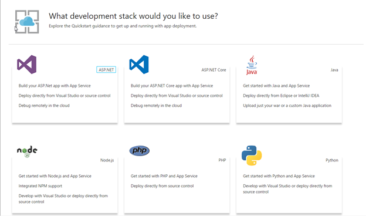
 
*Web App Quickstart*

3.	Click Deployment credentials

Deployment credentials allows you to set a username and password that can be used when needing to authenticate against the Web App administrative system that handles deployment.  These credentials are not just for FTP, but can also be used for basic auth when working with the SCM (site control manager) features or with other deployment options.

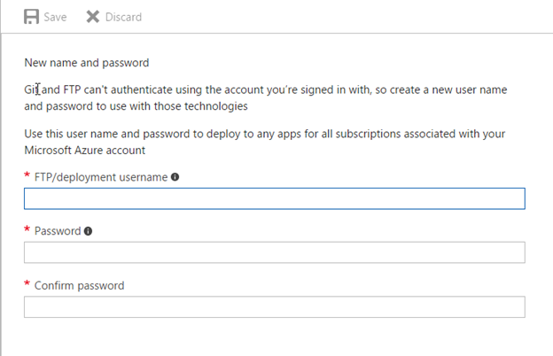
 
*Deployment Credentials*

4.	Click Deployment Slots

Deployment slots are only available for Standard and Premium App Service plans and are applications with their own host names.  The content and some configurations can be swapped between two of the slots.  By default there is always a Production slot.

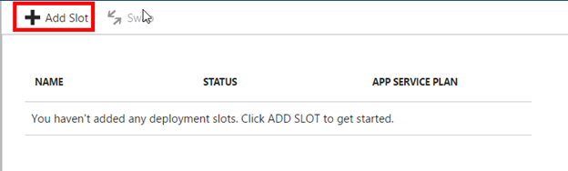
 
*Deployment Slots*

5.	Click on the Add Slot button
6.	Give the slot a Name of staging and click OK

This will create a staging slot for the web application

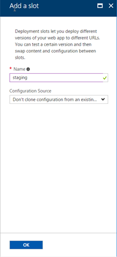

*Add a Slot blade*

7.	Back on the Deployment Slots list, click the Swap button in the top toolbar.

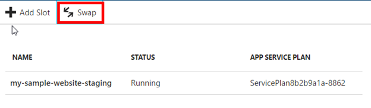

*Click Swap Button*

8.	The Swap blade is now showing.  This is where you can determine the source and destination of the swap.  

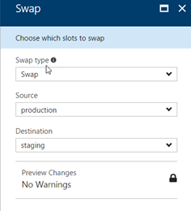

*Swap Blade*

Since there is no application in the web app, there is no reason to do a swap at this point.

9.	Close the Swap blade in order to get back to the Web App and the menu of features we are exploring.

10. Click on Deployment options and click the Choose Source item
Deployment options allows you to select the deployment type you would like to use and then once you select the source, you will be prompted to configure the source.  Each source configuration is different.

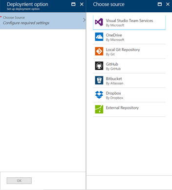

*Deployment Option Sources*

11. Close the Choose Source blade and the Deployment option blade to get back to the web app.
12. Click the Application settings

Application settings has several categories of settings:
* General settings – framework versions, platform bit-ness, websockets, always on, pipeline version, ARR Affinity, Auto Swap
* Debugging – remote debugging on/off and Visual Studio version
* App settings – name/value pairs that will be used by the web app – these will override settings by the same name in the web.config file.  They can also be set to not move when the slot is swapped.
* Connection strings – connection strings for external resources (like databases, redis cache, etc.).  They can be set to not move when a slot is swapped
* Default Documents – list of possible default document file names to load when the root URL is used on the web app.
* Handler mappings – allows you to add custom request handlers.
* Virtual applications and directories – allows you to configure virtual applications and virtual directories corresponding to the physical path on the web app.

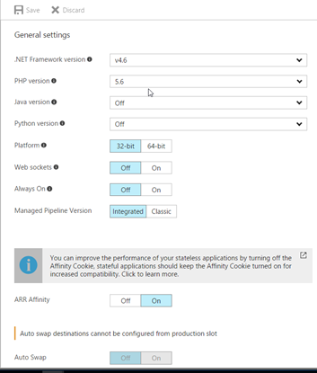

*Application Settings*

13. Click on Backups, then click on the information block

Backups allows you to configure a storage account and schedule to backup the site and optionally the connected database.

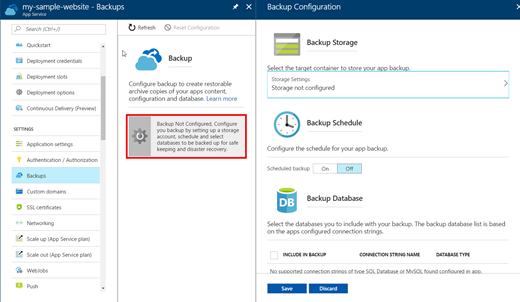

*Web App Backup Configuration*

14. Click Custom domains

Custom domains is where you configure and possibly buy the custom domain you want your web application to use.

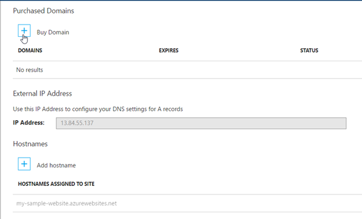

*Custom Domains*

15. Next, click SSL certificates

SSL certificates is where you connect your SSL certificate to your configured custom domains.
Note: if you use IP Based SSL, your IP Address will change causing you to need to remap any A records that are configured for the domain name
 
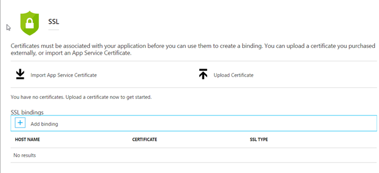

*SSL Certifications*

16. Next, click Networking

Under Networking there are a few options:
* VNET Integration – allows you to connect the web app to a VNET using a Point to Site VPN
* Hybrid connection – allows you to securely access on premises systems.  It uses the Hybrid Connection Manager (running on premises) to connect to Service Buss relay, so it usually doesn’t require firewall configurations to work.
* Azure Content Delivery Network – allows you to configure the CDN to cache content of your web app on the CDN.

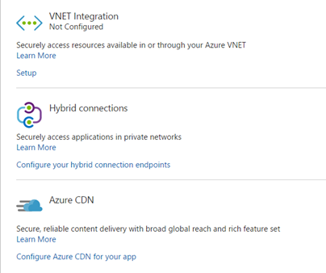
 
*Web App Networking*

17. Next, click on Scale up (App Service plan)

Scale up allows you to move your App Service plan to another plan (bigger or smaller).  This allows you to increase the machine resources if you need to or decrease them.

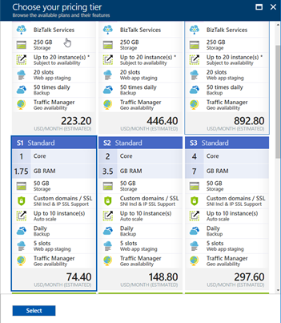

*Scale up/Pricing tier blade*

18. Close the pricing tier blade to get back to the web app and click Scale out (App Service plan)
Scale out allows you to set your instance count, enable/disable autoscale, set the auto scale conditions and rules.

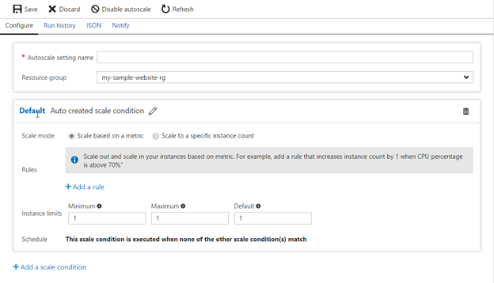

*Scale out autoscale conditions*

19. Next click WebJobs

WebJobs lets you run code either script files or executables in the background on the same machine as the Web App.  You can either run them on-demand, continuously or on a schedule.

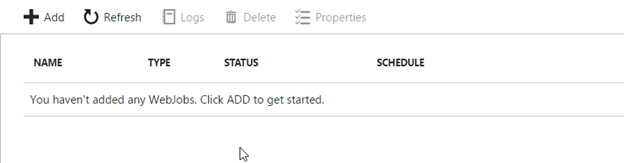

*WebJobs blade*

20. Next click Properties

Properties general configuration information about the Web App:
* Status – current status of the web app
* URL – public url of the web app
* Virtual IP Address – used for SSL binding
* Mode – Pricing tier mode (Free, Shared, Basic, Standard, Premium)
* Output IP Addresses – ip addresses of the front end pool of machines serving your web app
* Deployment Trigger URL – webhook url to notify Kudu when a deployment happens
* FTP/Deployment User – deployment credential
* FTP Host Name – url for ftp host
* FTP Diagnostic Logs – ftp url for diagnostic logs location
* FTPS Host Name – url for ftps host
* FTPS Diagnostic Logs – ftps for diagnostic logs location
* Resource ID – id for the web application resource
* Location – location the web application is deployed to
* Resource Group – name of the resource group the web application is in
* Subscription information (name and ID)
 
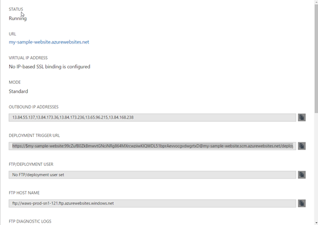

*Properties blade*

21. Next click App Service plan

App Service plan takes you to the App Service Plan resource the Web App is in, here you can view and configure the App Service level features.

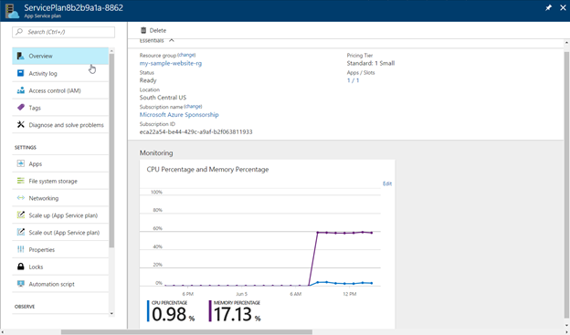

*App Service Plan*

22. Close the App Service plan blade and next click Quotas

Quotas provides the detail about how much of the File System Usage is being consumed and how much is left.

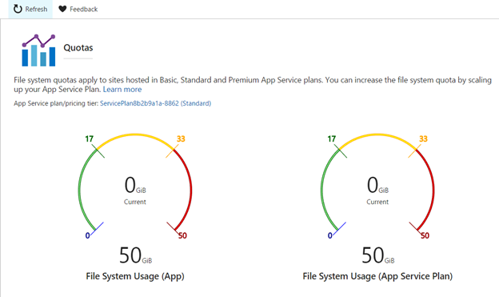
 
*Quotas Blade*

23. Next click on Resource Explorer

This gives you a link that will open the https://resources.azure.com site showing you the resources for the web app.  This is a great way to get familiar with the resources that are connected to a website.

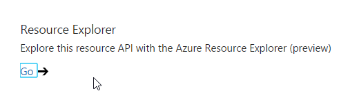

*Link to Resource Explorer*
 
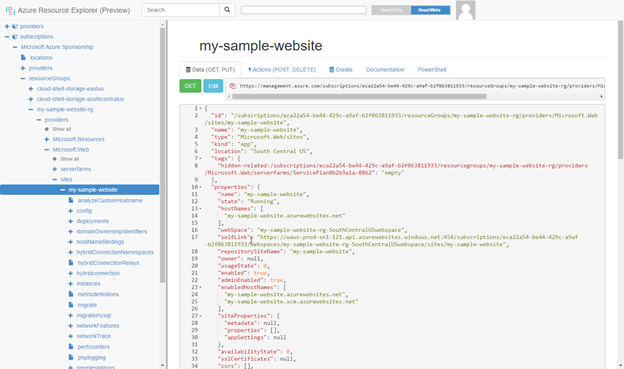

*Azure Resource Explorer*

24. Close the Resource Explorer tab in your browser and go back to the portal
25. Next click on Testing in production
Testing in production allows you to control the routing of traffic so you can send percentages to different slots of the same Web App.  Example would be 50% to staging and 50% to production.  

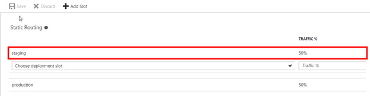

*Testing in production with 50% traffic going to staging and 50% going to production*

26. Next click on Alerts

Alerts allow you to configure notifications via email or webhook call when a metric or event occurs.

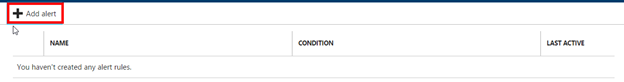

*Alerts blade*

27. Click on the Add Alert button

This shows you the Add an alert rule blade.  You can add alerts for metrics or events.  

The metrics are:
* Data In
* Data Out
* CPU Percentage
* Disk Queue Length
* Http Queue Length
* Memory Percentage
* The events are:
* Delete
* Scale down
* Scale up

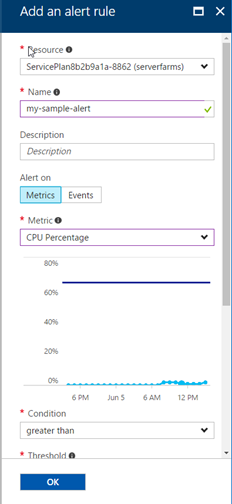

*Add Alert blade*

Next, lets delete the web app.

28. Click on Overview and then the Delete button in the toolbar.

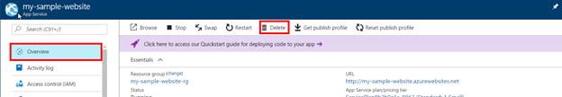

*Overview blade to select the delete button*

This will show the delete confirmation.

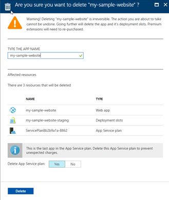

29. Enter the name of the app into the text box and click the Delete button.

## Summary

In this lab you have created a web app with two deployment slots and explored its features.  In the process, you also learned how to pin items to the dashboard.  You have also deleted the web app with its staging slot and its App Service Plan.

